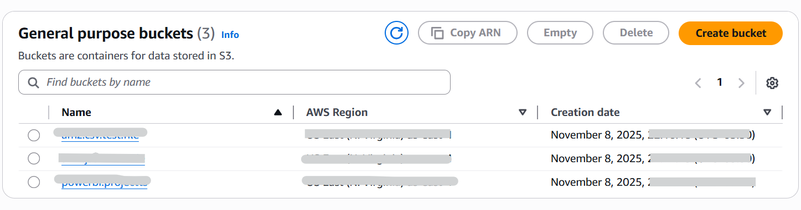
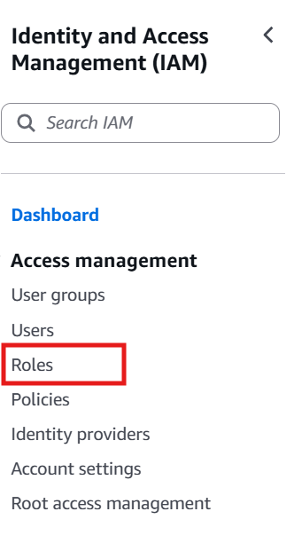
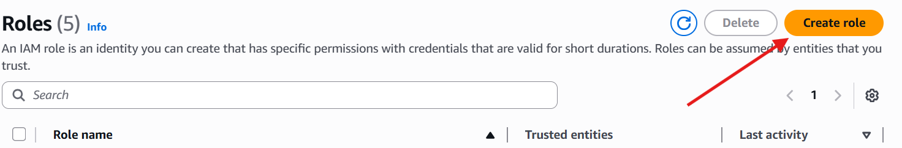
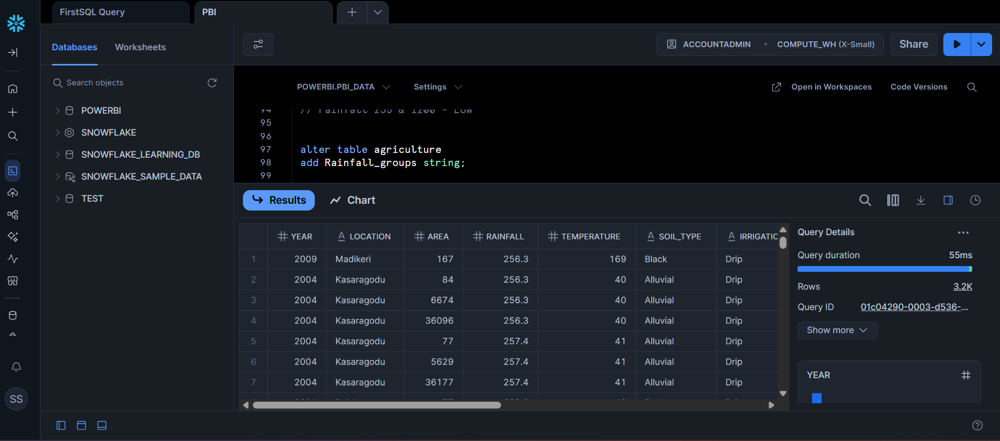
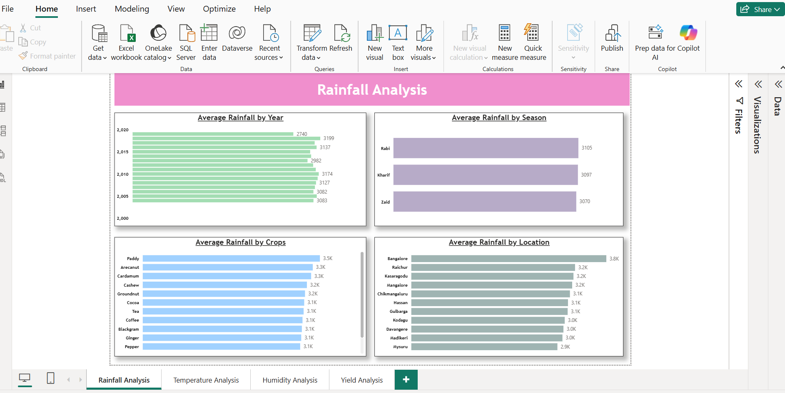
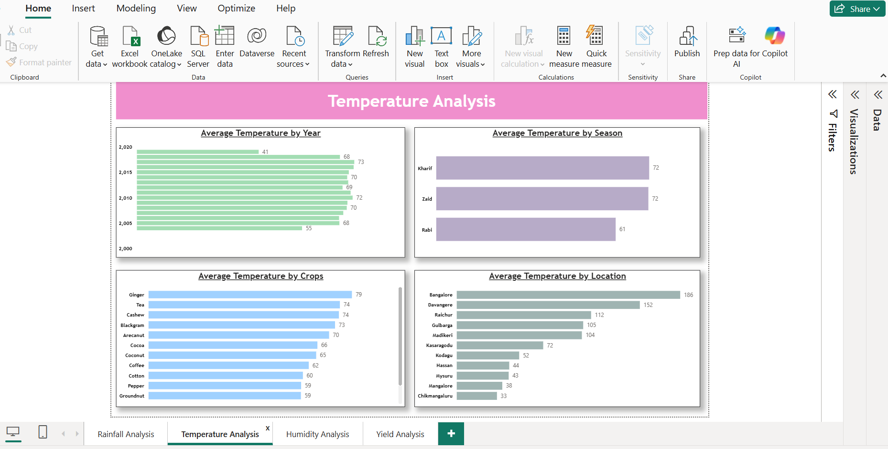
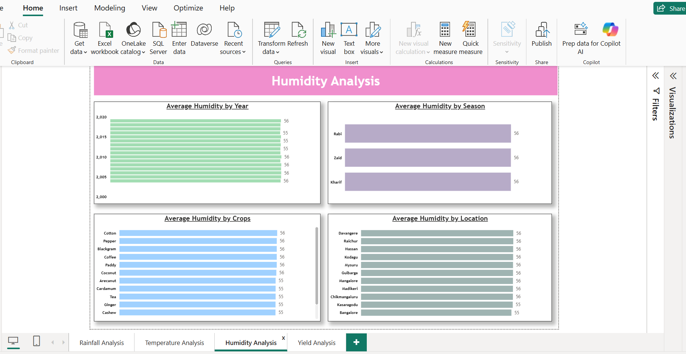
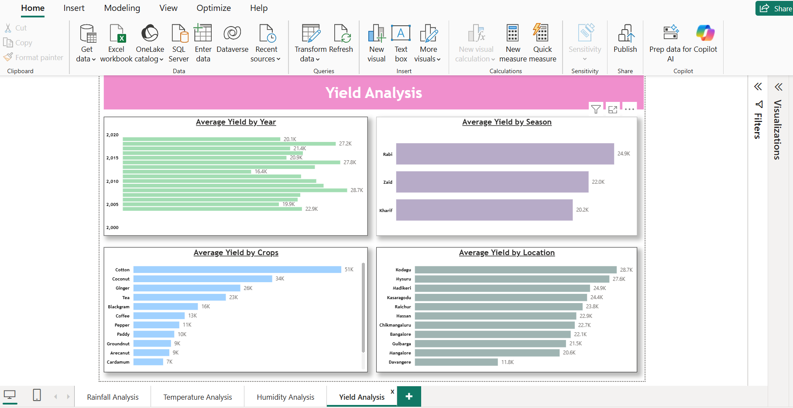

# Agriculture-Data-Dashboard


## Problem Statement

The agriculture sector in regions like Karnataka generates extensive data on weather patterns (rainfall, temperature, humidity), crop yields, and regional variations, yet untapped insights hinder sustainable farming and productivity. This dashboard delivers a comprehensive, interactive view of agricultural data to empower stakeholders such as farmers, agronomists, and policymakers to:

* Examine weather-crop relationships and yield trends across seasons and locations.
* Monitor environmental impacts on productivity and identify optimization opportunities.
* Facilitate targeted interventions via slicer filters and drill-down analytics for better resource management and climate-resilient practices.

Through visually intuitive and dynamic visualizations, this tool supports data-informed decisions to boost yields, mitigate risks from weather variability, and promote eco-friendly agriculture.

## Tech Stack

- **Data Source:** Snowflake (hosted on AWS)
- **Storage & Access:** AWS S3 Bucket with IAM Roles
- **Visualization:** Power BI Desktop & Service
- **Transformations:** SQL in Snowflake, DAX in Power BI

## Steps Followed

* **Step 1**: Connected to Snowflake database hosted on AWS via Power BI Desktop and imported the agriculture dataset, encompassing tables for weather metrics, crop yields, seasons, and locations in Karnataka. AWS S3 bucket and IAM role were used for secure data staging (see screenshot below for setup).

  - **AWS Overview**

  
  ---
  
  ---
  
  ---

  - **Snowflake Overiew**

    
     
 ---    
* **Step 2**: Executed data profiling in Power Query Editor by enabling column distribution, quality profiling, and full-dataset analysis to detect outliers in rainfall and yield data.

* **Step 3**: Reviewed for nulls and duplicates; minor gaps (<0.8%) in humidity records from sensor issues were preserved to maintain temporal integrity.

* **Step 4**: Applied transformations in Snowflake using SQL scripts for data enrichment:
  - Added and populated `Year_Group` column for temporal bucketing:
    ```
    UPDATE agriculture SET Year_Group = 'Y1' WHERE Year >= 2004 AND Year < 2009;
    UPDATE agriculture SET Year_Group = 'Y2' WHERE Year >= 2010 AND Year < 2015;
    UPDATE agriculture SET Year_Group = 'Y3' WHERE Year >= 2016 AND Year <= 2019;
    ```
    This groups years into Y1 (2004-2008), Y2 (2010-2014), and Y3 (2016-2019) for trend analysis across eras.
  - Added and populated `Rainfall_Groups` column for rainfall categorization (min: 255 mm, max: 4103 mm):
    ```
    UPDATE agriculture SET Rainfall_Groups = 'Low' WHERE Rainfall >= 255 AND Rainfall < 1200;
    UPDATE agriculture SET Rainfall_Groups = 'Medium' WHERE Rainfall >= 1200 AND Rainfall < 2800;
    UPDATE agriculture SET Rainfall_Groups = 'High' WHERE Rainfall >= 2800 AND Rainfall <= 4103;
    ```
    This enables segmented analysis of low (<1200 mm), medium (1200-2799 mm), and high (≥2800 mm) rainfall impacts on yields.
  - Additional transformations included date hierarchies for seasons (Rabi, Kharif, Zaid), unit standardization for yields (kg/ha), and data type validations for numerical metrics. Verified changes with `SELECT * FROM agriculture LIMIT 10;`.


* **Step 5**: Built bar charts for multi-dimensional analysis, including average rainfall/yield by year, season, crop, location, Year_Group, and Rainfall_Groups to highlight grouped trends (e.g., higher yields in 'Medium' rainfall during Y3).

* **Step 6**: Implemented a vibrant green-earth theme with consistent formatting for readability and professional appeal.

* **Step 7**: Published the report to Power BI Service for seamless sharing, real-time refreshes via Snowflake integration with AWS S3 stages, and collaborative access.

# Snapshot of Dashboard


## Power BI Desktop View

**Rainfall Analysis Page**:  
Features bar charts for average rainfall by year (2005-2020, peaking at ~3,200 mm in 2019), season (Kharif highest at ~3,087 mm), crops (Arecanut leads at 3.5k mm), and locations (Chikmagalur tops at 3.8k mm). Updated slicers include Year_Group and Rainfall_Groups for grouped filtering.  


**Temperature Analysis Page**:  
Bar charts showing average temperature by year (rising trend to ~73°C in 2015), season (Kharif and Zaid at 72°C), crops (Ginger highest at 79°C), and locations (Bangalore at 152? – note: scale may indicate combined metrics or °F; Davangere at 68°C).  


**Humidity Analysis Page**:  
Stable bar charts for average humidity by year (~56% consistent), season (all ~56%), crops (uniform at 55-56%), and locations (all ~55-56%, Bangalore lowest at 55%).  


**Yield Analysis Page**:  
Bar charts for average yield by year (peaking at 28k kg/ha in 2010), season (Rabi highest at 24k), crops (Cotton leads at 51k), and locations (Kodagu at 28k). New visuals segment by Year_Group (Y3 shows yield growth) and Rainfall_Groups (Medium drives 60% of high yields).  


# Insights
Following inferences can be drawn from the dashboard:

**[1] Rainfall Trends**

Annual rainfall increases from ~3,083 mm (2005) to ~3,199 mm (2020).
Kharif season highest at 3,087 mm; Arecanut crop at 3,500 mm; Chikmagalur location at 3,800 mm.

**[2] Temperature Patterns**

Peaks at ~73°C in 2015; Kharif/Zaid seasons at 72°C.
Ginger crop highest at 79°C; Bangalore location outlier at 152 (possible aggregate).

**[3] Humidity Stability**

Consistent at 56% across all years, seasons, crops, and most locations (Bangalore at 55%).

**[4] Yield Variations**

Peaks at 28,000 kg/ha in 2010; Rabi season highest at 24,000 kg/ha.
Cotton leads crops at 51,000 kg/ha; Kodagu location at 28,000 kg/ha.

These highlight Rabi's productivity edge and regional hotspots like Kodagu.

# Conclusion

This Agriculture Data Dashboard offers a holistic lens on weather-crop dynamics, enhanced by Year_Group and Rainfall_Groups for temporal and environmental segmentation. It empowers:

* Optimized planting schedules based on seasonal and grouped forecasts.
* Targeted support for underperforming locations/crops via AWS-secured data flows.
* Sustainable practices through yield-weather linkages.
* Policy formulation for resilient farming in variable climates.

As a pivotal analytics asset, it fosters growth, reduces losses, and advances data-centric agriculture for long-term food security.

---

**Author** - Rajat Singh  
B.Tech - Computer Science and Engineering | AI & Data Enthusiast  
Email: rajattsingh10@gmail.com | LinkedIn: https://www.linkedin.com/in/rajat-singh-bb941924a/
